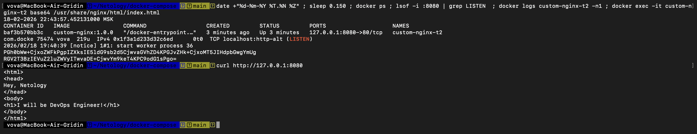
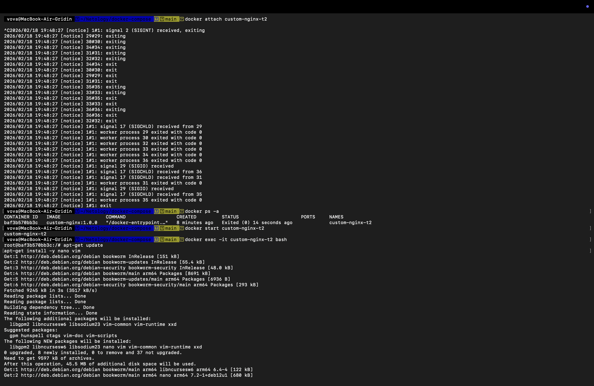
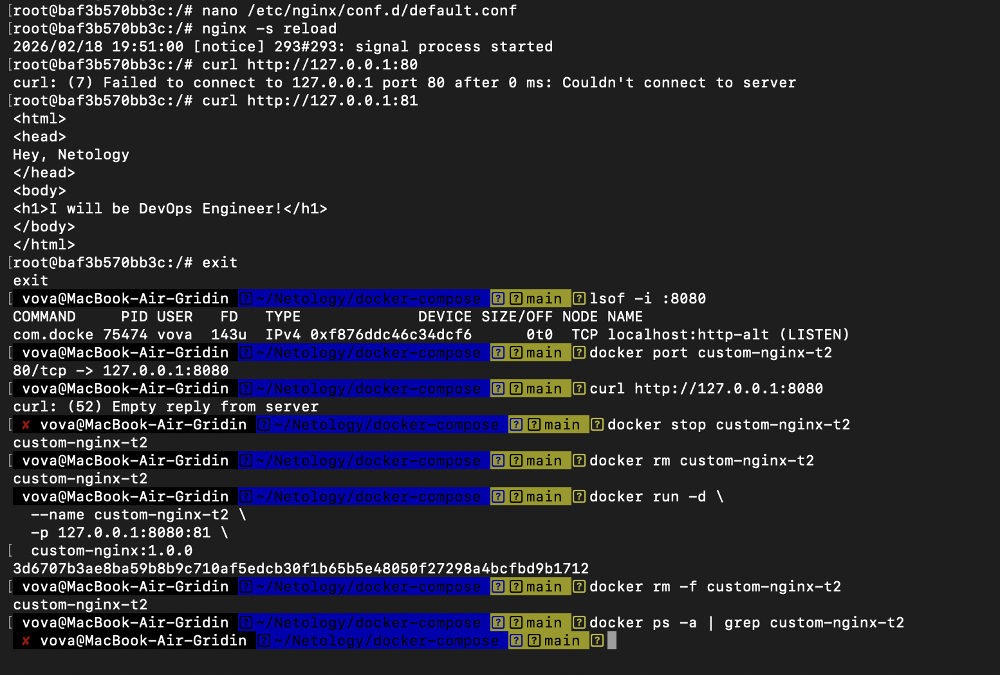
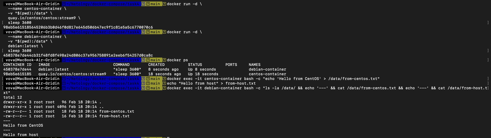
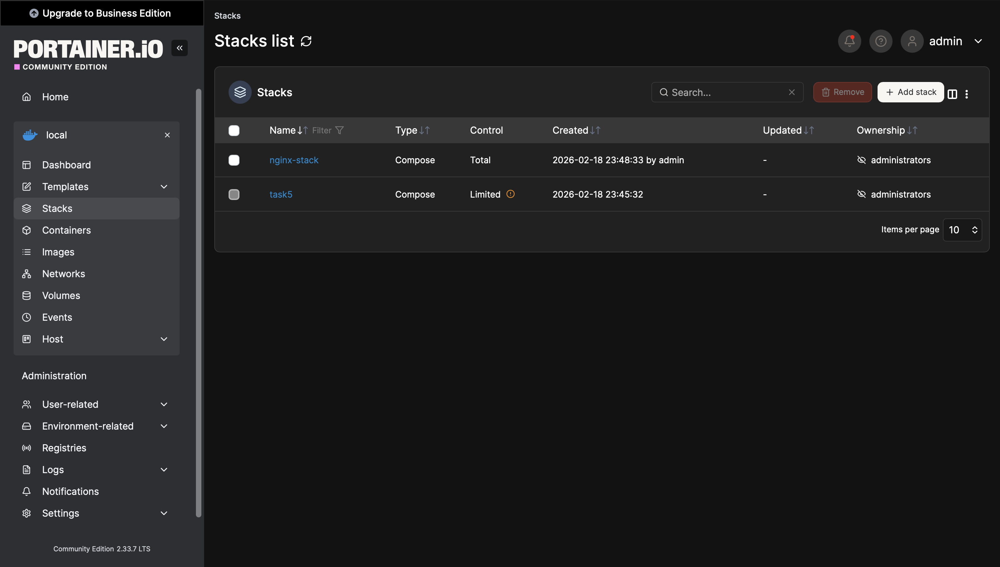
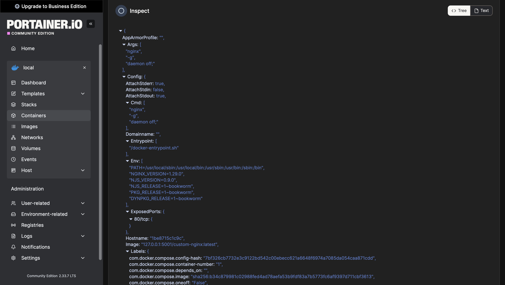
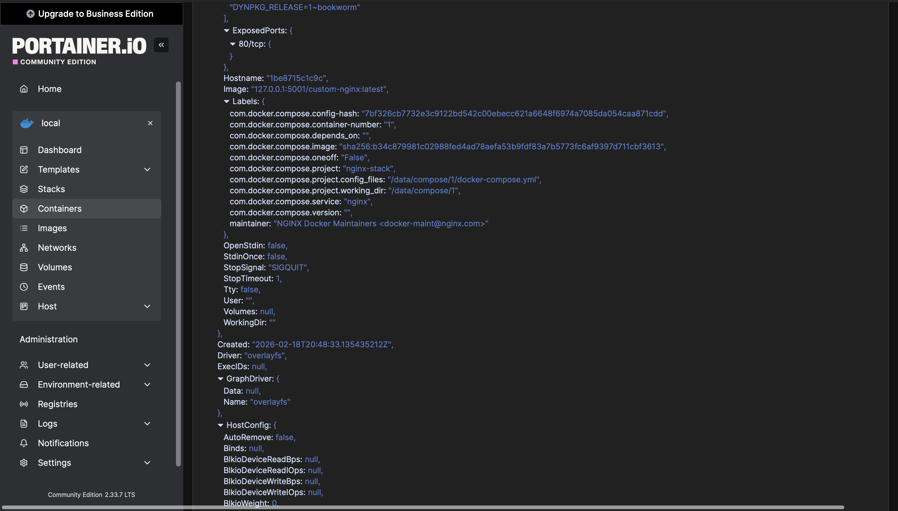
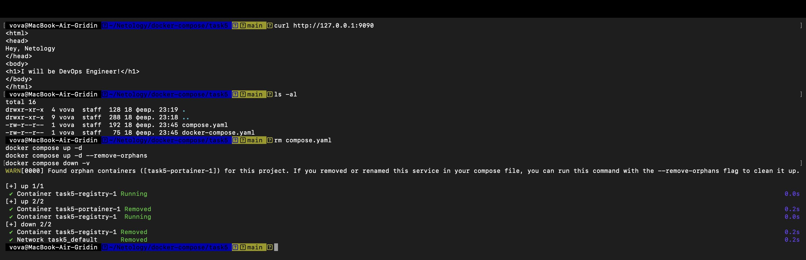
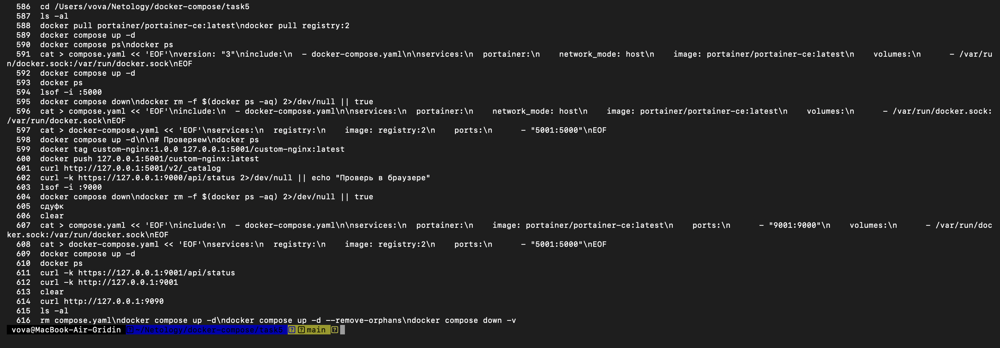

# Домашнее задание к занятию «Docker Compose»
**Выполнил:** Гридин Владимир

---

## Задача 1: Создание кастомного образа Nginx

### Команды

```bash
docker pull nginx:1.29.0
docker build -t custom-nginx:1.0.0 .
docker tag custom-nginx:1.0.0 dimirdin/custom-nginx:1.0.0
docker push dimirdin/custom-nginx:1.0.0
```

### Скриншот

Ссылка: https://hub.docker.com/r/dimirdin/custom-nginx

## Задача 2: Запуск и управление контейнером

### Команды

```bash

docker run -d --name "Gridin-custom-nginx-t2" -p 127.0.0.1:8080:80 custom-nginx:1.0.0
docker rename "Gridin-custom-nginx-t2" custom-nginx-t2
date +"%d-%m-%Y %T.%N %Z" ; sleep 0.150 ; docker ps ; lsof -i :8080 ; docker logs custom-nginx-t2 -n1 ; docker exec -it custom-nginx-t2 base64 /usr/share/nginx/html/index.html
curl http://127.0.0.1:8080
```

### Скриншот



## Задача 3: Подключение к потокам и отладка

### Команды

```bash
docker attach custom-nginx-t2  # Ctrl+C - контейнер остановится
docker ps -a
docker start custom-nginx-t2
docker exec -it custom-nginx-t2 bash
# apt-get update && apt-get install nano
# nano /etc/nginx/conf.d/default.conf  # listen 80 -> listen 81
# nginx -s reload
# curl http://127.0.0.1:80  # fail
# curl http://127.0.0.1:81  # ok
# exit
docker port custom-nginx-t2
curl http://127.0.0.1:8080  # fail - порт 8080 проброшен на 80, а nginx слушает 81
docker rm -f custom-nginx-t2
```

### Ответы

Почему остановился: docker attach передает Ctrl+C главному процессу (nginx)

Проблема с портом: проброс 8080:80, но nginx слушает 81

### Скриншоты





## Задача 4: Общий том между контейнерами

### Команды

```bash

# CentOS Stream (centos:latest недоступен)
docker run -d --name centos-container -v "$(pwd):/data" quay.io/centos/centos:stream9 sleep 3600
docker run -d --name debian-container -v "$(pwd):/data" debian:latest sleep 3600
docker exec centos-container bash -c "echo 'Hello from CentOS' > /data/from-centos.txt"
echo "Hello from host" > from-host.txt
docker exec debian-container bash -c "ls -la /data/ && cat /data/*"

### Примечание

centos:latest удален из Docker Hub (EOL декабрь 2021). Использован quay.io/centos/centos:stream9.

### Скриншот



## Задача 5: Docker Compose и Portainer

### Файлы

compose.yaml:

```yaml

include:
  - docker-compose.yaml
services:
  portainer:
    image: portainer/portainer-ce:latest
    ports:
      - "9001:9000"
    volumes:
      - /var/run/docker.sock:/var/run/docker.sock
```

docker-compose.yaml:

```yaml

services:
  registry:
    image: registry:2
    ports:
      - "5001:5000"
```

### Команды

```bash

docker compose up -d
# Запустился compose.yaml (приоритет над docker-compose.yaml)
docker tag custom-nginx:1.0.0 127.0.0.1:5001/custom-nginx:latest
docker push 127.0.0.1:5001/custom-nginx:latest
curl http://127.0.0.1:5001/v2/_catalog
# Portainer: http://127.0.0.1:9001 -> Stacks -> deploy nginx на 9090
rm compose.yaml
docker compose up -d  # warning: orphaned services
docker compose up -d --remove-orphans
docker compose down -v
```

Примечание

Порты 5000 и 9000 заняты macOS Control Center. Использованы 5001 и 9001.

### Скриншоты











Создай папку для скриншотов и добавь их:

```bash
mkdir -p ~/Netology/docker-compose/screenshots
```
